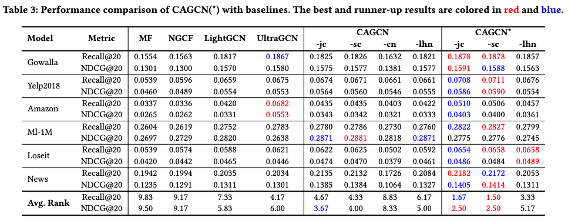

# Paper setting (links are randomly splitted into Training/Validation/Testing)
Following default setting used in most literature, we collect all users' interactions and randomly split them into training/testing data. Note that this splitting may cause the issue of using future links to predict past links, which is a little bit unrealistic. For more realistic setting, please refer to realistic setting folder [[here]](../Realistic_setting/).


## Configuration
The default version of python we use is 3.8.10. Please install all necessary python packages via:
```linux
- Pytorch 1.11.0 with Cuda 11.3
- Pytorch-geometric 2.0.4
- Torch-scatter 2.0.9
- Prettytable 3.2.0
```


## Data
We demonstrate the superority of CAGCN(*) on six datasets: Gowalla, Yelp2018, Amazon-book, Ml-1M, Loseit and Worldnews.
- The train1.txt/test1.txt: the observed and unobserved user-item interaction pairs. 
- co_ratio_edge_weight_x.pt: the precalculated Common Interacted Ratio (CIR) based on x, which is selected from: **Jaccard Similarity (JC), Salton Cosine Similarity (SC), Leicht-Holme-Nerman (LHN), and Common Neighbors (CN)**.
- The correct directory structure should be set as follows:
```linux
├── data
│   ├── amazon
│   │   ├── co_ratio_edge_weight_co.pt
│   │   ├── co_ratio_edge_weight_jc.pt
│   │   ├── co_ratio_edge_weight_lhn.pt
│   │   ├── co_ratio_edge_weight_sc.pt
│   │   ├── test1.txt
│   │   └── train1.txt
│   ├── gowalla
│   │   ├── co_ratio_edge_weight_co.pt
│   │   ├── co_ratio_edge_weight_jc.pt
│   │   ├── co_ratio_edge_weight_lhn.pt
│   │   ├── co_ratio_edge_weight_sc.pt
│   │   ├── test1.txt
│   │   └── train1.txt
│   ├── loseit
│   │   ├── co_ratio_edge_weight_co.pt
│   │   ├── co_ratio_edge_weight_jc.pt
│   │   ├── co_ratio_edge_weight_lhn.pt
│   │   ├── co_ratio_edge_weight_sc.pt
│   │   ├── test1.txt
│   │   └── train1.txt
│   ├── ml-1m
│   │   ├── co_ratio_edge_weight_co.pt
│   │   ├── co_ratio_edge_weight_jc.pt
│   │   ├── co_ratio_edge_weight_lhn.pt
│   │   ├── co_ratio_edge_weight_sc.pt
│   │   ├── test1.txt
│   │   └── train1.txt
│   ├── worldnews
│   │   ├── co_ratio_edge_weight_co.pt
│   │   ├── co_ratio_edge_weight_jc.pt
│   │   ├── co_ratio_edge_weight_lhn.pt
│   │   ├── co_ratio_edge_weight_sc.pt
│   │   ├── test1.txt
│   │   └── train1.txt
│   └── yelp2018
│       ├── co_ratio_edge_weight_co.pt
│       ├── co_ratio_edge_weight_jc.pt
│       ├── co_ratio_edge_weight_lhn.pt
│       ├── co_ratio_edge_weight_sc.pt
│       ├── test1.txt
│       └── train1.txt
├── dataprocess.py
├── evaluation.py
├── main_fusion.py
├── main.py
├── model.py
├── parse.py
├── run_amazon.sh
├── run_gowalla.sh
├── run_loseit.sh
├── run_ml1m.sh
├── run_world_news.sh
├── run_yelp.sh
└── utils.py
```


## Precalculating CIR for your own dataset
**Note that we also provide the code for readers to pre-calculate the co_ratio_edge_weight_x.pt of their own datasets.** To use it, please set up a separate dataset repo with the training and testing interactions and create your own bash.sh file:
```linux
bash run_xxx.sh
```
We have matrix-formed and node-wise calculation of CIR. The matrix-formed way is faster while requires more RAM while the node-wise calculation is slower but requires less RAM. To vary between these two modes, change the line in main.py/main_fusion.py as follows:
```linux
if args.dataset in ['amazon']:
    cal_trend = co_ratio_deg_user_jacard_sp
else:
    cal_trend = co_ratio_deg_user_jacard
```
- co_ratio_deg_user_jacard_sp: node-wise calculation
- co_ratio_deg_user_jacard: matrix-formed calculation

## Result
Here we list the performance of our models CAGCN(*) with different topological variants. To reproduce the performance and running time in the following Table, please run the following commands:
```linux
bash run_gowalla.sh
bash run_yelp.sh
bash run_amazon.sh
bash run_ml1m.sh
bash run_loseit.sh
bash run_worldnews.sh
```

